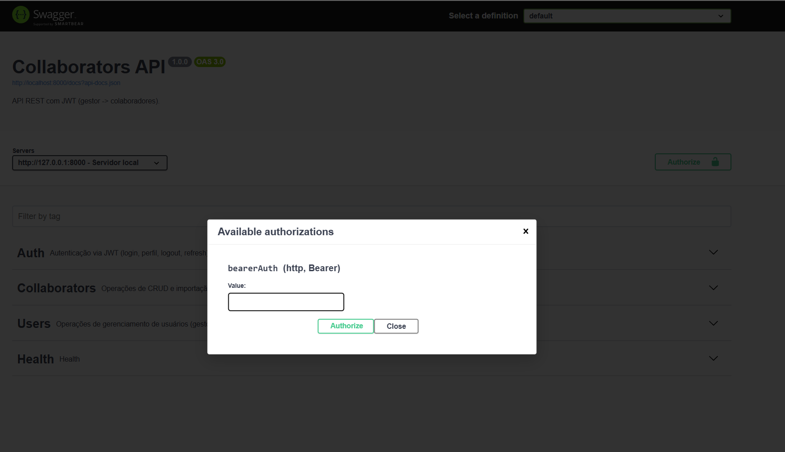
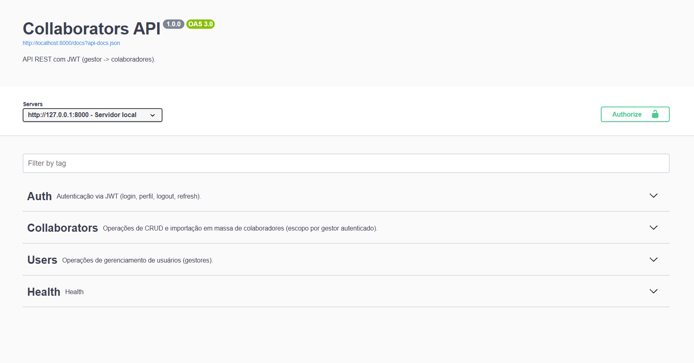

<p align="center"><a href="https://laravel.com" target="_blank"></a></p>

<p align="center">
<a href="#"></a>
<a href="#"></a>
<a href="#"></a>
<a href="#"></a>
<a href="#"></a>
</p>

# Projeto Laravel – API (PostgreSQL + Redis + JWT + Swagger)

API Laravel com autenticação **JWT**, documentação **Swagger (L5-Swagger)**, fila com **Redis**, importação em massa via **CSV** e orquestração mínima por **Makefile**.

- **Stack**: PHP 8.3, Laravel 11, PostgreSQL 16, Redis 7
- **Docs**: Swagger UI em `/api/documentation`
- **Auth**: `api/auth/login`, `api/auth/me`, `api/auth/logout`, `api/auth/refresh`
- **Domínio**: CRUD de `Collaborators` com importação CSV

---

## Índice

- [Requisitos](#requisitos)
- [Instalação rápida](#instalação-rápida)
  - [Linux / WSL2 (Ubuntu)](#linux--wsl2-ubuntu)
  - [Windows (PowerShell)](#windows-powershell)
- [Configuração do `.env`](#configuração-do-env)
- [Executando a aplicação](#executando-a-aplicação)
- [Swagger / OpenAPI](#swagger--openapi)
- [Autenticação JWT (exemplos)](#autenticação-jwt-exemplos)
- [Módulo de Colaboradores](#módulo-de-colaboradores)
- [Importação CSV](#importação-csv)
- [Comandos Make disponíveis](#comandos-make-disponíveis)
- [Troubleshooting](#troubleshooting)
- [Segurança](#segurança)
- [Licença](#licença)
- [Postaman](#postman)

---

## Requisitos

- **Docker** e **Docker Compose** (recomendado)  
- **Make** (o projeto inclui scripts para instalar automaticamente)  
- **PHP 8.3+** e **Composer** (se for executar Artisan fora de container)  
- **git** recomendado

> **Dica:** No Windows, use **WSL2** (Ubuntu) ou **PowerShell**. O projeto fornece scripts para instalar o `make`.

---

## Instalação rápida

### Linux / WSL2 (Ubuntu)

1) **Clonar o repositório**
```bash

git clone <seu-repo>.git
cd <seu-repo>

```

2) **Instalar `make` (se necessário)**
```bash
chmod +x scripts/install-make.sh
./scripts/install-make.sh
```

3) **Inicializar o projeto**
```bash
make init
```
Esse alvo irá:
- Garantir `.env` (copia de `.env.example` se necessário)
- Subir **Postgres** e **Redis** (`docker compose up -d`)
- Instalar dependências (`composer install`)
- Gerar `APP_KEY`
- Rodar **migrations** e **seed**
- Gerar a documentação Swagger
- (Opcional) Verificações de saúde

4) **Executar aplicação + worker**
```bash
make run
```
- Abre/roda **`php artisan serve`** e **`php artisan queue:work`** (em terminais separados, quando possível).
- Se a abertura automática de janelas não for suportada, o make vai exibir os comandos para você colar manualmente.

### Windows (PowerShell)

1) **Clonar o repositório** (no terminal do Windows ou no Git Bash)
```powershell
git clone <seu-repo>.git
cd <seu-repo>
```

2) **Instalar `make` automaticamente**
```powershell
powershell -ExecutionPolicy Bypass -File scripts\install-make.ps1
```

3) **Inicializar**
```powershell
make init
```

4) **Executar app + worker**
```powershell
make run 
```


```

 Se não quiser usar Make no Windows:  

 Suba serviços: `docker compose up -d`  
 Crie `.env` (copie `.env.example`)  
 `composer install && php artisan key:generate`  
 `php artisan migrate --force && php artisan db:seed --force`  
 `php artisan l5-swagger:generate`  
 Rodar: `php artisan serve` e, em outro terminal, `php artisan queue:work`

```
---

## Configuração do `.env`

Exemplo mínimo (coerente com `docker-compose.yml`):
```dotenv
APP_NAME=RettProject
APP_ENV=local
APP_KEY=
APP_DEBUG=true
APP_URL=http://localhost:8000

# Swagger (host usado no "Try it out")
L5_SWAGGER_CONST_HOST=http://localhost:8000

LOG_CHANNEL=stack
LOG_LEVEL=debug

DB_CONNECTION=pgsql
DB_HOST=127.0.0.1
DB_PORT=5433
DB_DATABASE=rett
DB_USERNAME=rett
DB_PASSWORD=rett1234

REDIS_CLIENT=phpredis
REDIS_HOST=127.0.0.1
REDIS_PORT=6379
REDIS_PASSWORD=null

CACHE_STORE=redis
QUEUE_CONNECTION=redis

MAIL_MAILER=log
MAIL_FROM_ADDRESS="hello@example.com"
MAIL_FROM_NAME="${APP_NAME}"

JWT_SECRET=<<sua_chave_jwt>>
```

> **Notas**
> - O **Postgres** expõe `5433` no host (mapeado ao `5432` do container).  
> - O `make init` cria `.env` se não existir e gera `APP_KEY`.  
> - Gere o `JWT_SECRET` com `php artisan jwt:secret` (se ainda não estiver no `.env`).

---

## Executando a aplicação

- **Servidor de desenvolvimento (Laravel)**
  - URL padrão: **http://localhost:8000**
  - Comando: `php artisan serve`

- **Worker de filas (Redis)**
  - Comando: `php artisan queue:work`

- **Subir/Parar serviços (DB e Redis)**
  ```bash
  docker compose up -d
  docker compose down
  ```

---

## Swagger / OpenAPI

- **Gerar documentação**
  ```bash
  php artisan l5-swagger:generate
  ```
  (O `make init` já chama isso para você.)

- **Acessar Swagger UI**
  - **http://localhost:8000/api/docs**
  - JSON: **http://localhost:8000/docs**

- **Autorização (Bearer JWT)**
  1. No Swagger UI, clique em **Authorize**.
  2. Informe: `Bearer <seu_token_jwt>` (com o prefixo `Bearer`).
  3. Clique em **Authorize** e **Close**.

<p align="center">
  
</p>

<p align="center">
  
</p>

**Dica – CORS/Network Failure**  
Se o Swagger mostrar `Network Failure`/`URL scheme must be "http" or "https"`, ajuste:
- `APP_URL` e `L5_SWAGGER_CONST_HOST` **com http/https** válidos (ex.: `http://localhost:8000`).  
- Se estiver atrás de Nginx/Proxy, garanta `X-Forwarded-Proto` correto.

---

## Autenticação JWT (exemplos)

**Login**
```bash
curl -X POST http://localhost:8000/api/auth/login \
  -H "Content-Type: application/json" \
  -d '{"email":"email.rett@outlook.com.br","password":"secret123"}'
```
Resposta (exemplo):
```json
{
  "access_token": "eyJ0eXAiOiJKV1QiLCJhbGci...",
  "token_type": "bearer",
  "expires_in": 3600
}
```

**Perfil**
```bash
curl http://localhost:8000/api/auth/me \
  -H "Authorization: Bearer <token>"
```

**Refresh**
```bash
curl -X POST http://localhost:8000/api/auth/refresh \
  -H "Authorization: Bearer <token>"
```

**Logout**
```bash
curl -X POST http://localhost:8000/api/auth/logout \
  -H "Authorization: Bearer <token>"
```

---

## Módulo de Colaboradores

Rotas principais (todas com `Authorization: Bearer <token>`):

- **GET** `/api/collaborators` – Lista paginada (`page`, `per_page`)
- **GET** `/api/collaborators/{id}` – Detalhe
- **POST** `/api/collaborators` – Criação
- **PUT** `/api/collaborators/{id}` – Atualização completa
- **PATCH** `/api/collaborators/{id}` – Atualização parcial
- **DELETE** `/api/collaborators/{id}` – Exclusão
- **POST** `/api/collaborators/imports` – Upload de CSV (processo assíncrono + e-mail)

---

## Importação CSV

- **Endpoint**: `POST /api/collaborators/imports` (multipart/form-data)
- **Campo**: `file` (CSV)
- **Cabeçalho esperado** (ordem flexível, nomes mapeados por normalização):
  - `name`, `email`, `cpf`, `city`, `state`, `phone` *(opcional)*
- **Exemplo CSV:**
```csv
name,email,cpf,city,state,phone
Ana Silva,ana@ex.com,123.456.789-01,São Paulo,São Paulo,11999990000
João Souza,joao@ex.com,98765432100,Campinas,SP,
```

> O serviço normaliza `cpf` para dígitos, e o **state** é armazenado por **nome completo** (`"São Paulo"`, `"Pará"`, etc.).  
> O processamento é em **fila**; ao concluir, um e-mail é enfileirado para o gestor.

---

## Comandos Make disponíveis

> Dependem dos arquivos em `scripts/` e do **Makefile** já configurado no projeto.

- `make init` – Setup completo (env, docker up, composer, key, migrate/seed, swagger)
- `make run` – Sobe **serve** e **queue:work** (dois terminais/processos)
- `make up` / `make down` – Sobe/derruba os serviços Docker (DB/Redis)
- `make migrate` – `php artisan migrate --force`
- `make seed` – `php artisan db:seed --force`
- `make refresh` – `migrate:fresh --seed`
- `make swagger` – `l5-swagger:generate`
- `make doctor` – Verificações básicas de ambiente
- `make stop` – Para processos iniciados pelo `make run` (quando gerenciados pelo make)

> Todos os alvos imprimem **"✅ já existe — ok"** quando a etapa já foi realizada anteriormente.

---

## Troubleshooting

**1) Porta em uso (8000, 8080)**
```bash
# Linux
sudo lsof -i :8000
kill -9 <PID>
# Windows (PowerShell)
netstat -ano | findstr :8000
taskkill /PID <PID> /F
```

**2) `There is no existing directory at "/var/www/html/storage/logs"`**  
Crie/permissões:
```bash
mkdir -p storage/framework/{cache,data,sessions,testing,views} bootstrap/cache storage/logs
chmod -R 775 storage bootstrap/cache
```

**3) `Class "Redis" not found` ao rodar Artisan no host**  
Instale a extensão PHP Redis no host (ou rode Artisan dentro de um container PHP que já tenha `phpredis` habilitado).

**4) Postgres: `role "xxx" does not exist`**  
Garanta que as credenciais do `.env` batem com `POSTGRES_USER/POSTGRES_PASSWORD` do `docker-compose.yml`.  
Para zerar tudo:
```bash
docker compose down -v   # remove volumes (reset do banco)
docker compose up -d
```

**5) Swagger – `Network Failure / URL scheme must be "http" or "https"`**  
Ajuste `APP_URL` e `L5_SWAGGER_CONST_HOST` com **http/https** válidos para seu ambiente. Em proxy/Nginx, envie `X-Forwarded-Proto`.

**6) 401 nas rotas protegidas**  
- Faça **login** e use **Bearer** no `Authorization`.  
- No Swagger, clique em **Authorize** e informe `Bearer <token>`.

---

## Postaman
Dentro do projeto existe um arquivo criado com nome de rett-api.postman_collection para utilizar e somente fazer o importe no postman 
- Script pra salvar token dentro dele ja criado

## Segurança

- Mantenha o `JWT_SECRET` seguro (não comitar `.env`).  
- Ajuste CORS conforme seu frontend/domínios.  
- Use `APP_ENV=production` e `APP_DEBUG=false` em produção.  
- Rotinas de fila e e-mail devem usar provedores adequados no `.env` de produção.

---

## Licença

Este projeto é open-source sob a licença **MIT**.

---

### Scripts citados (coloque no repositório)

**`scripts/install-make.sh`**
```bash
#!/usr/bin/env bash
set -e
if command -v make >/dev/null 2>&1; then
  echo "✅ make já instalado"
  exit 0
fi
if command -v apt-get >/dev/null 2>&1; then
  sudo apt-get update -y && sudo apt-get install -y make
  echo "✅ make instalado via apt-get"
  exit 0
fi
echo "⚠️ Instale o 'make' manualmente para sua distro (yum/dnf/pacman etc.)"
exit 1
```

**`scripts/install-make.ps1`**
```powershell
# Requires: PowerShell as Administrator para instalar choco
$ErrorActionPreference = "Stop"
if (Get-Command make -ErrorAction SilentlyContinue) {
  Write-Host "✅ make já instalado"
  exit 0
}
if (-not (Get-Command choco -ErrorAction SilentlyContinue)) {
  Write-Host "🔧 Instalando Chocolatey..."
  Set-ExecutionPolicy Bypass -Scope Process -Force
  [System.Net.ServicePointManager]::SecurityProtocol = [System.Net.SecurityProtocolType]::Tls12
  Invoke-Expression ((New-Object System.Net.WebClient).DownloadString('https://chocolatey.org/install.ps1'))
}
choco install make -y
Write-Host "✅ make instalado"
```
